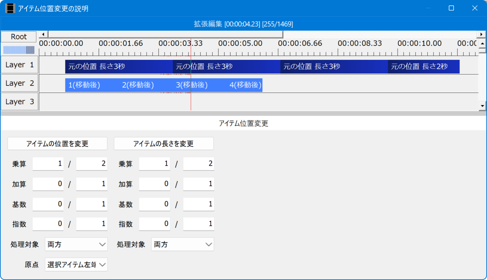
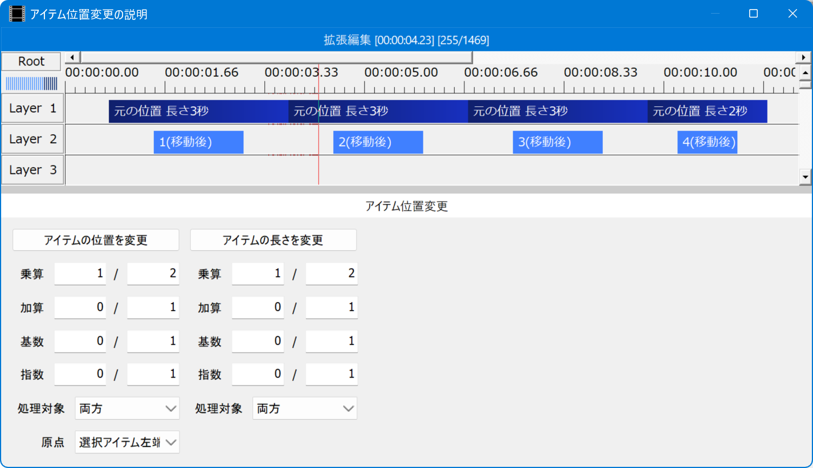
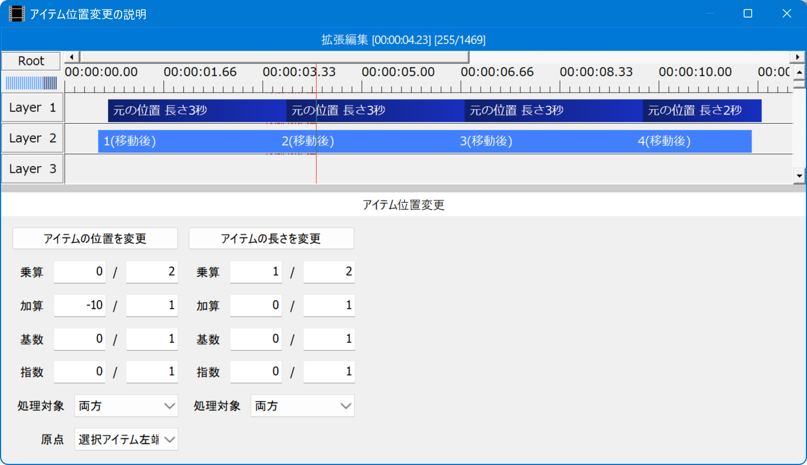
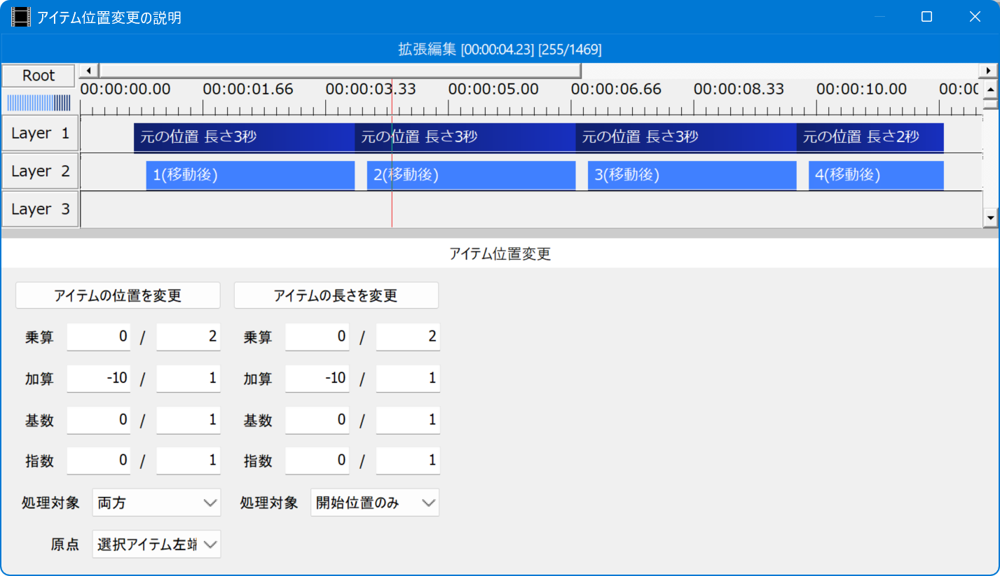
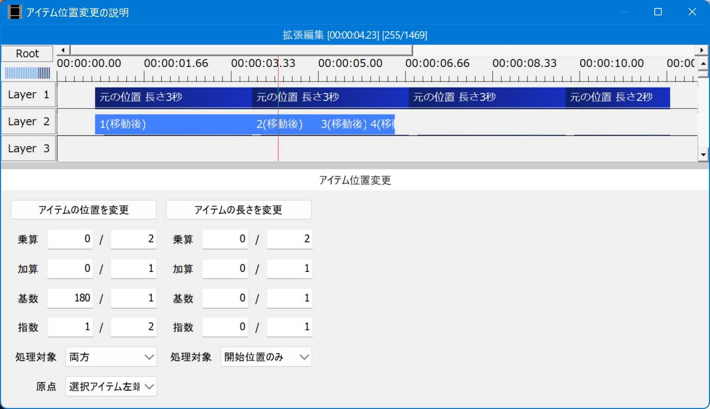

# 🚀『アイテム位置変更』アドイン

* タイムラインのアイテムの位置を変更(アフィン変換)します。

## 💡使い方

1. `aviutlウィンドウ`のメニューで`編集`➡`アルティメットプラグイン`➡`アイテム位置変更`を選択します。
1. `アイテム位置変更`ウィンドウが表示されます。
1. `タイムライン(拡張編集ウィンドウ)`でアイテムを選択します。
1. `アイテム位置変更`ウィンドウ内のボタンを押します。
1. `アイテム位置変更`ウィンドウ内の設定値に応じて、選択アイテムの位置が変わります。

## 🎨『アイテム位置変更』ウィンドウ

* `アイテムの位置を変更` ✏️選択アイテムの位置を変更します。
	* アイテムの位置に対して`位置 * 乗算 + 加算`を実行します。
	* `基数`と`指数`が指定されている場合は、先に`基数 * pow(位置 / 基数, 指数)`を実行します。
* `乗算` ✏️乗算の値を分数で指定します。
* `加算` ✏️加算の値を分数で指定します。
* `基数` ✏️累乗の基数を分数で指定します。
* `指数` ✏️累乗の指数を分数で指定します。
	* 分子または分母が0の場合は指定なしとなり、計算に使用されません。
* `処理対象` ✏️処理対象のアイテム位置を選択します。
	* `開始位置のみ` ✏️開始位置のみを変更します。
	* `終了位置のみ` ✏️終了位置のみを変更します。
	* `両方` ✏️開始位置と終了位置の両方を変更します。
* `基準位置` ✏️アイテムの位置を変更するときの基準位置(原点)を指定します。
	* `シーン左端` ✏️現在のシーンの左端(0)を原点にします。
	* `シーン右端` ✏️現在のシーンの右端(最終フレーム)を原点にします。
	* `選択アイテム左端` ✏️最も左にある選択アイテムの開始位置を原点にします。
	* `選択アイテム右端` ✏️最も右にある選択アイテムの終了位置を原点にします。
	* `現在フレーム` ✏️現在フレームを原点にします。
* `アイテムの長さを変更` ✏️選択アイテムの長さを変更します。
	* アイテムの長さに対して`長さ * 乗算 + 加算`を実行します。
	* その他の設定値は`アイテムの位置を変更`と同じです。

## 📷スクリーンショット

### 📌選択アイテムの位置を1/2

### 📌選択アイテムの長さを1/2

### 📌選択アイテムの位置を-10

### 📌選択アイテムの長さを-10 (開始位置のみ)

### 📌選択アイテムの位置を1/2乗

