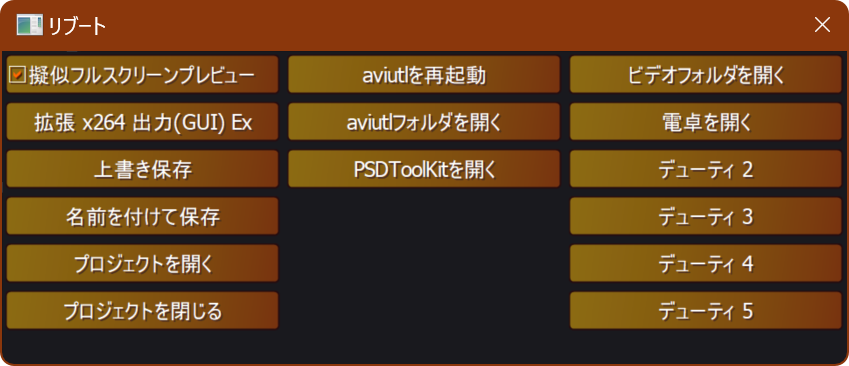

# 🎉『リブート』アドイン

* 再生時、プレビューを擬似フルスクリーンで表示します。
* ワンクリックでプラグイン出力を実行します。
* ワンクリックでaviutlを再起動します。
* ワンクリックでプロジェクトファイルを操作します。
* ワンクリックで任意のコマンドを実行します。

## 💡使い方

1. AviUtlウィンドウのメニューで『編集』➡『アルティメットプラグイン』➡『リブート』を選択します。
1. 『リブート』ウィンドウが表示されます。

## 💡擬似フルスクリーンプレビュー

1. 『擬似フルスクリーンプレビュー』チェックボックスにチェックを入れます。
1. aviutlでプレビューを再生します。

### 🔧設定方法

1. 『擬似フルスクリーンプレビュー』チェックボックスを右クリックします。
1. コンテキストメニューが表示されます。

* 📝設定項目
	* `フレームを表示` ✏️プレビューの左上にフレーム番号を表示します。
	* `時間を表示` ✏️プレビューの左上に時間を表示します。

## 💡プラグイン出力

1. 『プラグイン出力』ボタンに出力プラグインを割り当てます。
1. 『プラグイン出力』ボタンを押します。
1. 指定した出力プラグインで動画の出力が開始できます。

### 🔧設定方法

1. 『プラグイン出力』ボタンを右クリックします。
1. コンテキストメニューが表示されます。

* 📝設定項目
	* `プラグイン名` ✏️出力に使用するプラグインを選択します。
		* 選択したプラグイン名が『プラグイン出力』ボタンに表示されるようになります。

## 💡上書き保存

* プロジェクトを上書き保存します。

## 💡名前を付けて保存

* プロジェクトを名前を付けて保存します。

## 💡プロジェクトを開く

* プロジェクト選択ダイアログを開きます。

## 💡プロジェクトを閉じる

* 現在開いているプロジェクトを閉じます。

## 💡aviutlを再起動

1. 『aviutlを再起動』ボタンを押します。
1. aviutlが再起動します。

### 🔧設定方法

1. 『aviutlを再起動』ボタンを右クリックします。
1. コンテキストメニューが表示されます。

* 📝設定項目
	* `再起動前に上書き保存する` ✏️再起動前にプロジェクトを上書き保存します。

## 💡aviutlフォルダを開く

* aviutlがあるフォルダが表示されます。

## 💡PSDToolKitを開く

1. 『PSDToolKitを開く』ボタンを押します。
1. PSDToolKitウィンドウが表示されます。

* 『ワークスペース化』アドインには対応していません。
* 『ワークスペース化』アドインまたは類似プラグインを無効化している場合にのみ有効です。

## 💡ランチャー

1. 『デューティ N』ボタンにコマンドを割り当てます。
1. 『デューティ N』ボタンを押します。
1. 割り当てられたコマンドが実行されます。

### 🔧設定方法

1. 『デューティ N』ボタンを右クリックします。
1. 『デューティのオプション』ダイアログが表示されます。

* 📝設定項目
	* `名前` ✏️ボタン名を指定します。
	* `動詞` ✏️通常は空を指定します。一部のプログラムで`print`などが使用できます。
	* `パス` ✏️プログラムやファイル・フォルダのパスを指定します。
	* `引数` ✏️`パス`でプログラムを指定した場合、そのプログラムに渡す引数を指定します。
