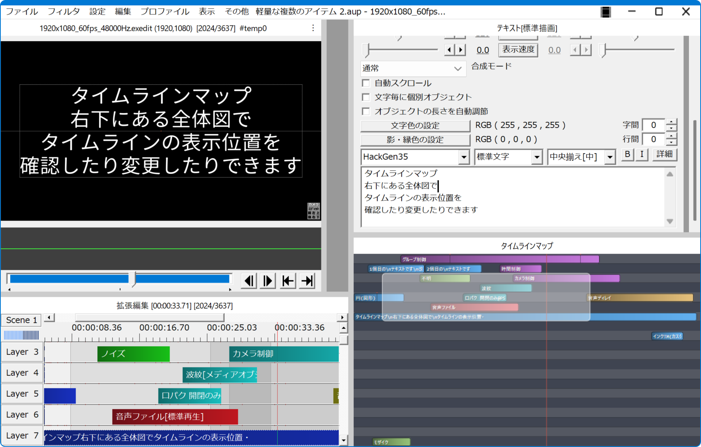

# 🚀『タイムラインマップ』アドイン

* タイムラインの全体図を表示します。

## 💡使い方

1. `aviutlウィンドウ`のメニューで`編集`➡`アルティメットプラグイン`➡`タイムラインマップ`を選択します。
1. `タイムラインマップ`ウィンドウが表示されます。
1. `タイムラインマップ`ウィンドウ内をクリック(もしくはドラッグ)します。
1. `拡張編集ウィンドウ`の表示位置がクリックした地点に移動します。

## 🎨『タイムラインマップ』ウィンドウ

* 右クリックで`コンテキストメニュー`を表示できます。

### 📝コンテキストメニュー

* `描画設定` ✏️`タイムラインマップの描画設定`ダイアログを表示します。

## 🎨『タイムラインマップの描画設定』ダイアログ

* 色選択ボタンの横にあるエディットボックスはアルファ(0~255)です。

### 🏷️テキストの設定

* `フォント名` ✏️テキストの描画に使用するフォントです。
* `フォントサイズ` ✏️テキストの描画サイズです。0の場合は自動(可変)になります。単位は1/100pxです。
* `文字の色` ✏️文字の色です。
* `影の色` ✏️影の色です。
* `パディング` ✏️テキスト周りのスペースの大きさです。単位は1/100pxです。
* `影のオフセット` ✏️影のずらし量です。どちらも0なら影は描画されません。単位は1/100pxです。
* `水平アライン` ✏️テキストの水平アラインです。
* `垂直アライン` ✏️テキストの垂直アラインです。

### 🏷️アイテムの設定

* `丸角サイズ` ✏️アイテムの丸角の基本サイズです。
* `丸角モード` ✏️アイテムの丸角モードです。
	* `なし` ✏️丸角にしません。`丸角サイズ`は無視されます。
	* `絶対` ✏️`丸角サイズ`の単位が1/100pxになります。
	* `相対` ✏️`丸角サイズ`の単位が最も短い辺を基準とした1/100%になります。
	* `個別` ✏️`丸角サイズ`の単位が個別の辺を基準とした1/100%になります。
		* 矩形の高さが丸角の幅、矩形の幅が丸角の高さの基準となります。
* `縁の色` ✏️アイテムの縁の色です。
* `縁の幅` ✏️アイテムの縁の幅です。単位は1/100pxです。

* `映像メディア` ✏️映像メディアアイテムの開始色と終了色です。
* `映像フィルタ` ✏️映像フィルタアイテムの開始色と終了色です。
* `音声メディア` ✏️音声メディアアイテムの開始色と終了色です。
* `音声フィルタ` ✏️音声フィルタアイテムの開始色と終了色です。
* `映像フィルタ効果` ✏️映像フィルタ効果アイテムの開始色と終了色です。
* `制御` ✏️制御アイテムの開始色と終了色です。

### 🏷️レイヤーの設定

* `上部のスペース` ✏️レイヤー上部のスペースです。
	* 単位はレイヤーの高さを基準とした1/100%です。
	* アイテムの高さと中間点図形の大きさに影響します。
* `奇数の色` ✏️奇数レイヤーの色です。
* `偶数の色` ✏️偶数レイヤーの色です。

### 🏷️中間点の設定

* `図形の色` ✏️中間点を表す図形の色です。
* `線の色` ✏️中間点を示す縦線の色です。
* `線の幅` ✏️中間点を示す縦線の幅です。単位は1/100pxです。

### 🏷️現在フレームの設定

* `線の色` ✏️現在フレームを示す縦線の色です。
* `線の幅` ✏️現在フレームを示す縦線の幅です。単位は1/100pxです。

### 🏷️可視範囲の設定

* `丸角サイズ` ✏️可視範囲の丸角の基本サイズです。
* `丸角モード` ✏️可視範囲の丸角モードです。
	* これらの項目は`🏷️アイテムの設定`と同じように指定されます。
* `図形の色` ✏️可視範囲を表す図形の色です。
* `線の色` ✏️可視範囲を示す縦線の色です。
* `線の幅` ✏️可視範囲を示す縦線の幅です。単位は1/100pxです。
