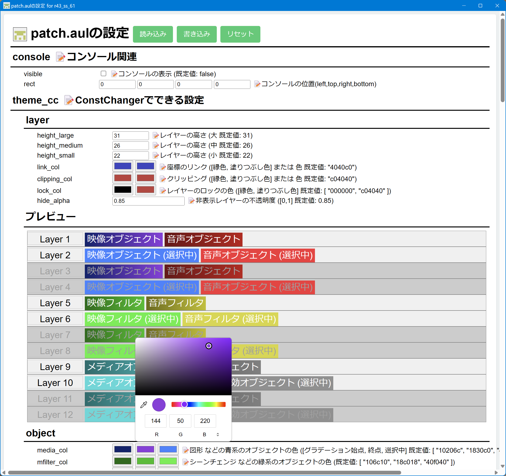
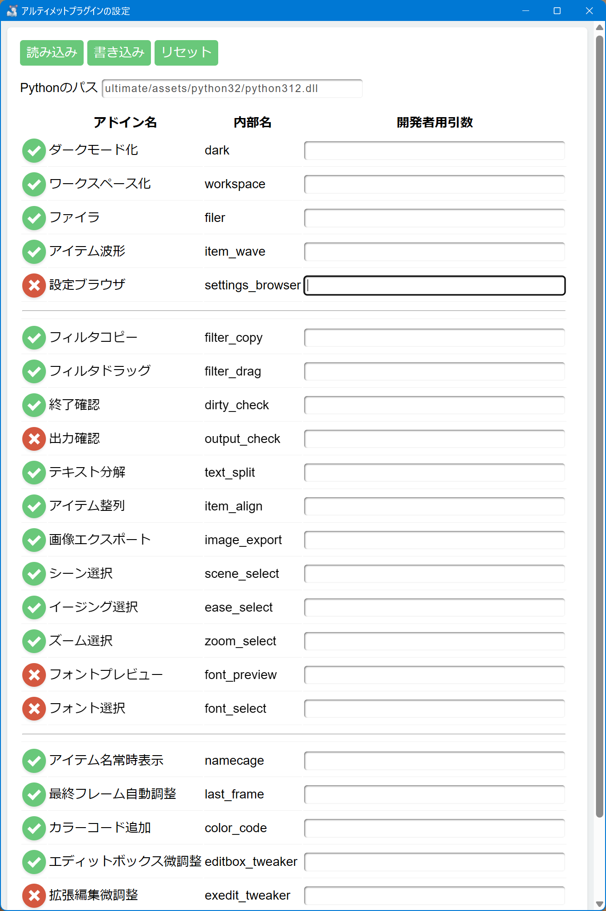

# 🎉『ローカルウェブアプリ』

* ローカルファイルを編集します。
* htmlベースで動作します。

## 💡使い方

1. エクスプローラで`plugins/ultimate/ui`フォルダ内にある拡張子が`.html_local`のファイルをダブルクリックして実行します。
1. アプリ選択ウィンドウが表示されます。
1. `plugins/ultimate/module/local_web_app.exe`を選択します。
1. `常に使う`を選択すると、次回からは自動的に『ローカルウェブアプリ』が起動します。

## 📷スクリーンショット

